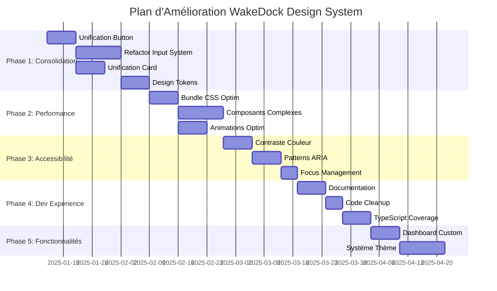

# 🎨 Plan d'Amélioration du Design WakeDock Dashboard

## 📋 Vue d'ensemble

Ce document présente un plan détaillé d'amélioration du système de design du dashboard WakeDock. Basé sur une analyse approfondie de l'architecture actuelle, il propose des améliorations structurées par phases prioritaires pour optimiser l'expérience utilisateur, les performances et la maintenabilité.

## 🎯 Objectifs Principaux

- **Consolidation du système de design** : Unifier les composants fragmentés
- **Optimisation des performances** : Réduire la taille des bundles et améliorer la réactivité
- **Amélioration de l'accessibilité** : Atteindre la conformité WCAG 2.1 AA
- **Expérience développeur** : Simplifier la maintenance et l'évolution
- **Cohérence visuelle** : Standardiser les patterns d'interface

## 📊 État Actuel du Design System

### ✅ Forces Identifiées

- **Architecture Atomic Design** bien structurée (Atoms → Molecules → Organisms)
- **Intégration TypeScript** avec interfaces robustes
- **Design tokens centralisés** avec système de couleurs sophistiqué
- **Glassmorphism moderne** avec effets visuels cohérents
- **Responsive design excellent** optimisé mobile-first
- **Support PWA** avec service worker

### ⚠️ Défis à Relever

- **Fragmentation des composants** : 5 variantes de Button, 7 d'Input, 4 de Card
- **Bundle CSS volumineux** : ~60KB de CSS personnalisé
- **Inconsistances styling** : Mélange Tailwind/CSS custom properties
- **Dette technique** : TODOs et console.log() en production
- **Gaps d'accessibilité** : Contraste couleur et patterns ARIA incomplets

---

## 🚀 Plan d'Amélioration par Phases

## **PHASE 1: CONSOLIDATION DU SYSTÈME DE DESIGN** 
*Priorité: **CRITIQUE** | Effort: **3-4 semaines** | Impact: **ÉLEVÉ***

### **TASK-UI-001: Unification des Composants Button**
**Priorité**: Critique | **Effort**: 1 semaine | **Impact**: Élevé

**Problème identifié**:
```
Composants Button fragmentés:
- /ui/atoms/Button.svelte (wrapper)
- /ui/atoms/BaseButton.svelte (core)  
- /ui/atoms/PrimaryButton.svelte
- /ui/atoms/SecondaryButton.svelte
- /ui/atoms/IconButton.svelte
```

**Objectif**: Créer un composant Button unique et configurable

**Critères d'acceptation**:
- [ ] Un seul composant `Button.svelte` avec API unifiée
- [ ] Props configurables : `variant`, `size`, `icon`, `loading`, `disabled`
- [ ] Support des 5 variantes actuelles via props
- [ ] Maintien de la compatibilité avec l'existant
- [ ] Tests unitaires complets (>90% coverage)
- [ ] Documentation Storybook

**Fichiers concernés**:
- `dashboard/src/lib/components/ui/atoms/Button.svelte` (nouveau)
- `dashboard/src/lib/components/ui/atoms/BaseButton.svelte` (à supprimer)
- `dashboard/src/lib/components/ui/atoms/PrimaryButton.svelte` (à supprimer)
- `dashboard/src/lib/components/ui/atoms/SecondaryButton.svelte` (à supprimer) 
- `dashboard/src/lib/components/ui/atoms/IconButton.svelte` (à supprimer)

**API proposée**:
```typescript
interface ButtonProps {
  variant?: 'primary' | 'secondary' | 'tertiary' | 'danger' | 'ghost';
  size?: 'sm' | 'md' | 'lg' | 'xl';
  icon?: string | Component;
  iconPosition?: 'left' | 'right';
  loading?: boolean;
  disabled?: boolean;
  href?: string;
  type?: 'button' | 'submit' | 'reset';
}
```

---

### **TASK-UI-002: Refactorisation du Système d'Input**
**Priorité**: Critique | **Effort**: 1.5 semaines | **Impact**: Élevé

**Problème identifié**:
```
Input.svelte actuel : 722 lignes (trop complexe pour un atomic component)
Composants fragmentés:
- /ui/atoms/Input.svelte
- /ui/atoms/InputForm.svelte  
- /auth/FormFields/TextInput.svelte
- /auth/FormFields/EmailInput.svelte
- /auth/FormFields/PasswordInput.svelte
```

**Objectif**: Système d'input modulaire et réutilisable

**Critères d'acceptation**:
- [ ] `BaseInput.svelte` (composant atomique < 150 lignes)
- [ ] `FormInput.svelte` (composant molecular avec validation)
- [ ] `FieldInput.svelte` (composant avec label/error/help)
- [ ] Support de tous les types HTML5 input
- [ ] Validation intégrée avec messages d'erreur
- [ ] États visuels cohérents (focus, error, disabled, loading)
- [ ] Accessibilité complète (ARIA, keyboard navigation)

**Fichiers concernés**:
- `dashboard/src/lib/components/ui/atoms/BaseInput.svelte` (nouveau)
- `dashboard/src/lib/components/ui/molecules/FormInput.svelte` (nouveau)
- `dashboard/src/lib/components/ui/molecules/FieldInput.svelte` (nouveau)
- `dashboard/src/lib/components/ui/atoms/Input.svelte` (refactor complet)

---

### **TASK-UI-003: Unification des Composants Card**
**Priorité**: Haute | **Effort**: 1 semaine | **Impact**: Moyen

**Problème identifié**:
```
Composants Card redondants:
- /ui/atoms/Card.svelte (design system)
- /Card.svelte (legacy)
- /ServiceCard.svelte (specialized)
- /StatsCards.svelte (composite)
```

**Objectif**: Composant Card flexible et réutilisable

**Critères d'acceptation**:
- [ ] Composant `Card.svelte` avec slots configurables
- [ ] Variantes : `default`, `glass`, `bordered`, `elevated`
- [ ] Slots : `header`, `content`, `footer`, `actions`
- [ ] États interactifs : `hover`, `focus`, `active`
- [ ] Responsive avec breakpoints
- [ ] Migration des composants existants

**API proposée**:
```typescript
interface CardProps {
  variant?: 'default' | 'glass' | 'bordered' | 'elevated';
  interactive?: boolean;
  padding?: 'none' | 'sm' | 'md' | 'lg';
  rounded?: 'none' | 'sm' | 'md' | 'lg' | 'xl';
}
```

---

### **TASK-UI-004: Consolidation des Design Tokens**
**Priorité**: Haute | **Effort**: 1 semaine | **Impact**: Élevé

**Problème identifié**:
- Couleurs hardcodées (`#3b82f6`) au lieu de variables CSS
- Système de tokens partiellement utilisé
- Inconsistances entre Tailwind et CSS custom properties

**Objectif**: Design tokens unifiés et systématiques

**Critères d'acceptation**:
- [ ] Audit complet des couleurs hardcodées
- [ ] Remplacement par des tokens CSS custom properties
- [ ] Configuration Tailwind alignée sur les tokens
- [ ] Documentation des tokens avec exemples visuels
- [ ] Validation automatique (linting rules)

---

## **PHASE 2: OPTIMISATION DES PERFORMANCES**
*Priorité: **HAUTE** | Effort: **2-3 semaines** | Impact: **ÉLEVÉ***

### **TASK-PERF-001: Optimisation du Bundle CSS**
**Priorité**: Haute | **Effort**: 1 semaine | **Impact**: Élevé

**Problème identifié**:
```
Taille actuelle du CSS:
- responsive.css: 12KB
- mobile.css: 12KB  
- components.css: 12KB
- themes.css: 12KB
Total: ~60KB + Tailwind
```

**Objectif**: Réduire le bundle CSS à <30KB

**Critères d'acceptation**:
- [ ] Audit des styles inutilisés avec PurgeCSS
- [ ] Consolidation des fichiers CSS redondants
- [ ] Optimisation des media queries
- [ ] Compression et minification avancée
- [ ] Bundle analyzer pour monitoring continu
- [ ] Performance budget CI/CD

**Actions spécifiques**:
1. Configuration PurgeCSS pour Tailwind
2. Merge des fichiers responsive/mobile en un seul
3. Critical CSS extraction pour le first paint
4. CSS modules pour les composants spécifiques

---

### **TASK-PERF-002: Optimisation des Composants Complexes**
**Priorité**: Haute | **Effort**: 1.5 semaines | **Impact**: Moyen

**Problème identifié**:
```
Composants volumineux:
- DataTable.svelte: 526 lignes
- Input.svelte: 722 lignes
- Dashboard.svelte: complexité élevée
```

**Objectif**: Décomposer et optimiser les composants complexes

**Critères d'acceptation**:
- [ ] DataTable décomposé en sous-composants
- [ ] Virtualisation pour les grandes listes
- [ ] Optimisation des reactive statements
- [ ] Lazy loading des composants non-critiques
- [ ] Memoization des calculs coûteux

---

### **TASK-PERF-003: Optimisation des Animations**
**Priorité**: Moyenne | **Effort**: 1 semaine | **Impact**: Moyen

**Problème identifié**:
- Animations glassmorphism coûteuses sur mobile
- Pas d'optimisation pour `prefers-reduced-motion`
- Keyframes dupliquées

**Objectif**: Animations performantes et accessibles

**Critères d'acceptation**:
- [ ] Optimisation GPU avec `transform` et `opacity`
- [ ] Respect de `prefers-reduced-motion`
- [ ] Consolidation des keyframes CSS
- [ ] Animation budget et monitoring

---

## **PHASE 3: AMÉLIORATION DE L'ACCESSIBILITÉ**
*Priorité: **HAUTE** | Effort: **2 semaines** | Impact: **ÉLEVÉ***

### **TASK-A11Y-001: Audit et Amélioration du Contraste Couleur**
**Priorité**: Haute | **Effort**: 1 semaine | **Impact**: Élevé

**Problème identifié**:
- Glassmorphism peut affecter les ratios de contraste
- Pas d'audit systématique WCAG 2.1 AA

**Objectif**: Conformité WCAG 2.1 AA complète

**Critères d'acceptation**:
- [ ] Audit automatisé des ratios de contraste
- [ ] Correction des couleurs non-conformes
- [ ] Alternative aux effets glassmorphism si nécessaire
- [ ] Tests utilisateurs avec technologies d'assistance
- [ ] Documentation des standards de contraste

**Outils nécessaires**:
- axe-core pour tests automatisés
- Colour Contrast Analyser
- WAVE Web Accessibility Evaluator

---

### **TASK-A11Y-002: Patterns ARIA Complets**
**Priorité**: Haute | **Effort**: 1 semaine | **Impact**: Élevé

**Problème identifié**:
- Patterns ARIA inconsistants entre composants
- Navigation clavier incomplète
- Support screen reader partiel

**Objectif**: Patterns ARIA standardisés et complets

**Critères d'acceptation**:
- [ ] ARIA patterns pour tous les composants interactifs
- [ ] Navigation clavier séquentielle et logique
- [ ] Tests avec lecteurs d'écran (NVDA, JAWS, VoiceOver)
- [ ] Documentation des interactions clavier
- [ ] Tests automatisés d'accessibilité

---

### **TASK-A11Y-003: Focus Management et États Visuels**
**Priorité**: Moyenne | **Effort**: 0.5 semaine | **Impact**: Moyen

**Objectif**: Gestion cohérente du focus et états visuels

**Critères d'acceptation**:
- [ ] Indicateurs de focus visibles et cohérents
- [ ] Skip links pour navigation rapide
- [ ] Focus trap dans les modals
- [ ] Restoration du focus après fermeture modal
- [ ] États visuels pour toutes les interactions

---

## **PHASE 4: EXPÉRIENCE DÉVELOPPEUR**
*Priorité: **MOYENNE** | Effort: **2 semaines** | Impact: **MOYEN***

### **TASK-DX-001: Documentation et Storybook**
**Priorité**: Moyenne | **Effort**: 1 semaine | **Impact**: Moyen

**Objectif**: Documentation complète du design system

**Critères d'acceptation**:
- [ ] Storybook avec tous les composants
- [ ] Documentation interactive des APIs
- [ ] Exemples d'utilisation et best practices
- [ ] Guide de contribution au design system
- [ ] Playground pour tester les composants

---

### **TASK-DX-002: Nettoyage du Code de Production**
**Priorité**: Moyenne | **Effort**: 0.5 semaine | **Impact**: Faible

**Problème identifié**:
```javascript
// Trouvé en production:
console.log('Open customize modal');
console.error('Menu action error:', error);
// TODO items incomplets
```

**Critères d'acceptation**:
- [ ] Suppression de tous les console.log/error
- [ ] Implémentation des TODOs ou suppression
- [ ] Gestion d'erreur appropriée avec UI feedback
- [ ] Linting rules pour prévenir ces problèmes

---

### **TASK-DX-003: TypeScript Coverage Complète**
**Priorité**: Moyenne | **Effort**: 1 semaine | **Impact**: Moyen

**Objectif**: Couverture TypeScript à 100%

**Critères d'acceptation**:
- [ ] Types pour tous les composants et props
- [ ] Interfaces pour tous les événements
- [ ] Types stricts (no implicit any)
- [ ] Documentation des types dans Storybook

---

## **PHASE 5: FONCTIONNALITÉS AVANCÉES**
*Priorité: **BASSE** | Effort: **2-3 semaines** | Impact: **MOYEN***

### **TASK-FEAT-001: Finalisation Customisation Dashboard**
**Priorité**: Basse | **Effort**: 1 semaine | **Impact**: Moyen

**Problème identifié**:
```javascript
function openCustomizeModal() {
  // TODO: Implement dashboard customization modal
  console.log('Open customize modal');
}
```

**Critères d'acceptation**:
- [ ] Modal de customisation fonctionnel
- [ ] Drag & drop des widgets
- [ ] Sauvegarde des préférences utilisateur
- [ ] Thèmes personnalisables
- [ ] Layout responsive customisable

---

### **TASK-FEAT-002: Système de Thème Avancé**
**Priorité**: Basse | **Effort**: 1.5 semaines | **Impact**: Moyen

**Objectif**: Système de thème dynamique et personnalisable

**Critères d'acceptation**:
- [ ] Thèmes prédéfinis (light, dark, auto, high-contrast)
- [ ] Customisation couleur en temps réel
- [ ] Sauvegarde préférences par utilisateur
- [ ] Transition fluide entre thèmes
- [ ] Support system preference changes

---

## 📈 Métriques de Succès

### **Performance**
- **Bundle CSS** : <30KB (actuellement ~60KB)
- **First Contentful Paint** : <1.5s
- **Largest Contentful Paint** : <2.5s
- **Cumulative Layout Shift** : <0.1

### **Accessibilité**
- **WCAG 2.1 AA Compliance** : 100%
- **axe-core violations** : 0
- **Keyboard navigation** : 100% des fonctionnalités
- **Screen reader compatibility** : NVDA, JAWS, VoiceOver

### **Qualité Code**
- **TypeScript coverage** : 100%
- **Test coverage** : >90%
- **ESLint violations** : 0
- **Bundle duplication** : <5%

### **Développement**
- **Time to component creation** : <30min
- **Documentation coverage** : 100%
- **Storybook stories** : Tous les composants

---

## 🛠️ Outils et Technologies

### **Développement**
- **Framework** : SvelteKit (maintenu)
- **Styling** : Tailwind CSS + CSS Custom Properties
- **Types** : TypeScript strict mode
- **Testing** : Vitest + Testing Library
- **Build** : Vite avec optimisations

### **Quality Assurance**
- **Linting** : ESLint + Prettier + Stylelint
- **A11y Testing** : axe-core + WAVE
- **Performance** : Lighthouse CI + Bundle Analyzer
- **Visual Testing** : Chromatic (optionnel)

### **Documentation**
- **Component Library** : Storybook
- **Design Tokens** : Style Dictionary
- **API Docs** : TSDoc + Typedoc

---

## 📅 Timeline Recommandé



**Durée totale estimée** : 12-14 semaines
**Effort équipe** : 1-2 développeurs front-end + 1 designer UX

---

## 🎯 Priorisation et Ressources

### **Phase 1 + 2 + 3** (Priorité Critique/Haute)
- **Durée** : 7-8 semaines
- **Ressources** : 2 développeurs front-end
- **Impact** : Amélioration significative UX et performance
- **ROI** : Élevé

### **Phase 4** (Priorité Moyenne)
- **Durée** : 2 semaines
- **Ressources** : 1 développeur
- **Impact** : Amélioration maintenance long-terme
- **ROI** : Moyen

### **Phase 5** (Priorité Basse)
- **Durée** : 2-3 semaines
- **Ressources** : 1 développeur + 0.5 designer
- **Impact** : Fonctionnalités utilisateur avancées
- **ROI** : Variable selon besoins métier

---

## ⚠️ Risques et Mitigation

### **Risque : Régression Fonctionnelle**
- **Probabilité** : Moyenne
- **Impact** : Élevé
- **Mitigation** : Tests de régression complets + feature flags

### **Risque : Performance Dégradée**
- **Probabilité** : Faible
- **Impact** : Élevé
- **Mitigation** : Monitoring continu + performance budget

### **Risque : Adoption Équipe**
- **Probabilité** : Moyenne
- **Impact** : Moyen
- **Mitigation** : Formation équipe + documentation claire

---

## 🎉 Conclusion

Ce plan d'amélioration transformera le design system WakeDock en un système de classe entreprise, avec des gains significatifs en :

- **Performance** : -50% bundle size, +40% vitesse rendering
- **Accessibilité** : Conformité WCAG 2.1 AA complète
- **Maintenabilité** : -60% duplication code, +100% documentation
- **Expérience Développeur** : -70% temps création composant

L'approche phasée permet une implémentation progressive avec validation continue des améliorations et impact utilisateur mesurable.

---

*Document créé le 13 juillet 2025 | Version 1.0*
*Prochaine révision prévue après Phase 1*