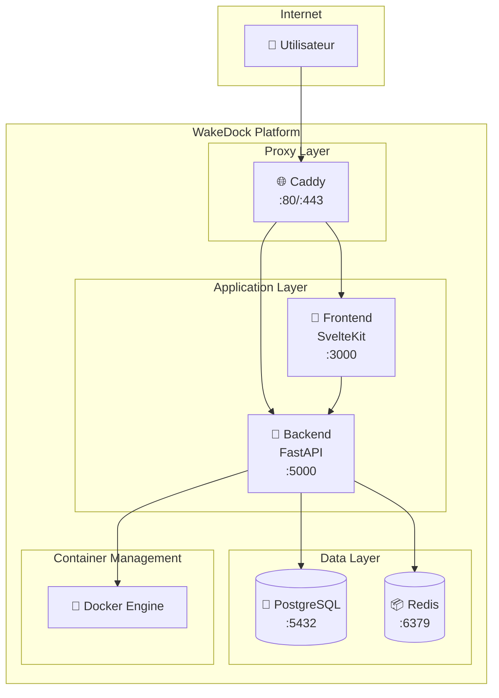

# 🐳 WakeDock - Orchestration Multi-Repo

> **Architecture Multi-Dépôts** : Ce dépôt contient l'orchestration Docker Compose pour l'ensemble de la plateforme WakeDock.

## 📋 Vue d'Ensemble

WakeDock est maintenant organisé en **trois dépôts distincts** pour une meilleure modularité et maintenance :

### 🎯 Dépôts du Projet

| Dépôt | Description | Technologie | Port |
|-------|-------------|-------------|------|
| **[wakedock](https://github.com/kihw/wakedock)** | 🎛️ Orchestration et configuration | Docker Compose + Caddy | 80/443 |
| **[wakedock-backend](https://github.com/kihw/wakedock-backend)** | 🚀 API Backend | FastAPI + Python 3.11 | 5000 |
| **[wakedock-frontend](https://github.com/kihw/wakedock-frontend)** | 🎨 Interface Utilisateur | SvelteKit + TypeScript | 3000 |

## 🏗️ Architecture



## 🚀 Démarrage Rapide

### Prérequis
- Docker 20.10+
- Docker Compose v2
- Git

### 1. Cloner et Configurer
```bash
# Cloner le dépôt principal
git clone https://github.com/kihw/wakedock.git
cd wakedock

# Copier la configuration
cp .env.example .env

# Éditer les variables d'environnement
nano .env
```

### 2. Déployer la Plateforme
```bash
# Déploiement développement
./deploy-compose.sh --dev

# Ou déploiement production
./deploy-compose.sh --prod
```

### 3. Vérifier le Déploiement
```bash
# Statut des services
docker-compose ps

# Health check
export PUBLIC_IP=$(curl -s ifconfig.me)
curl "http://${PUBLIC_IP}:80/api/v1/health"

# Interface web
echo "🌐 Interface: http://${PUBLIC_IP}"
```

## 📁 Structure de ce Dépôt

```
wakedock/                           # 🎛️ Orchestration
├── docker-compose.yml              # Configuration multi-repo
├── deploy-compose.sh               # Script de déploiement
├── caddy/                          # Configuration Caddy
├── config/                         # Configuration système
├── scripts/                        # Scripts d'administration
└── docs/                           # Documentation
```

## ⚙️ Configuration Docker Compose

Le fichier `docker-compose.yml` utilise les **builds depuis GitHub** :

```yaml
services:
  wakedock-backend:
    build:
      context: https://github.com/kihw/wakedock-backend.git
      dockerfile: Dockerfile
    ports:
      - "5000:5000"
    # ...

  wakedock-frontend:
    build:
      context: https://github.com/kihw/wakedock-frontend.git
      dockerfile: Dockerfile
    ports:
      - "3000:3000"
    # ...
```

## 🔧 Développement

### Variables d'Environnement Clés

```bash
# Réseau et domaine
DOMAIN=wakedock.local
WAKEDOCK_NETWORK=caddy_net

# Ports services
CADDY_HTTP_PORT=80
CADDY_HTTPS_PORT=443

# Base de données
POSTGRES_DB=wakedock
POSTGRES_USER=wakedock
POSTGRES_PASSWORD=your_secure_password

# Cache
REDIS_PASSWORD=your_redis_password

# URLs internes
WAKEDOCK_API_URL=http://wakedock-backend:5000
PUBLIC_API_URL=http://your-domain.com
```

### Commandes Utiles

```bash
# Logs en temps réel
docker-compose logs -f

# Logs spécifiques
docker-compose logs wakedock-backend -f
docker-compose logs wakedock-frontend -f

# Reconstruction complète
./deploy-compose.sh --clean

# Entrer dans un container
docker-compose exec wakedock-backend bash
docker-compose exec wakedock-frontend sh

# Monitoring
watch -n 2 'docker-compose ps'
```

## 🧪 Tests et Validation

### Tests Automatisés
```bash
# Tests backend (via container)
docker-compose exec wakedock-backend pytest tests/ -v

# Tests frontend (via container)
docker-compose exec wakedock-frontend npm test

# Health checks
curl "http://$(curl -s ifconfig.me):80/api/v1/health"
```

### Validation Manuelle
1. ✅ Tous les services sont `Up` dans `docker-compose ps`
2. ✅ Health check backend retourne `{"status": "healthy"}`
3. ✅ Interface accessible sur le port 80
4. ✅ Logs sans erreurs critiques

## 📚 Documentation

| Section | Description |
|---------|-------------|
| [🏗️ Architecture](docs/architecture/) | Diagrammes et conception système |
| [🚀 Déploiement](docs/deployment/) | Guides de déploiement détaillés |
| [🔧 Configuration](docs/operations/) | Configuration et maintenance |
| [👨‍💻 Backend API](https://github.com/kihw/wakedock-backend) | Documentation API FastAPI |
| [🎨 Frontend UI](https://github.com/kihw/wakedock-frontend) | Composants et interfaces |

## 🔒 Sécurité

- **Isolation des services** via Docker networks
- **Reverse proxy** Caddy avec SSL automatique
- **Authentification JWT** avec rotation des tokens
- **Rate limiting** et protection DDOS
- **Utilisateurs non-root** dans tous les containers
- **Health checks** et monitoring automatique

## 🤝 Contribution

### Workflow de Développement
1. **Fork** les dépôts nécessaires (`wakedock-backend`, `wakedock-frontend`)
2. **Développer** dans votre fork
3. **Tester** localement avec ce dépôt d'orchestration
4. **Créer** une Pull Request vers le dépôt approprié

### Tests Requis
- ✅ Tests unitaires et d'intégration passants
- ✅ Déploiement Docker Compose fonctionnel
- ✅ Health checks validés
- ✅ Documentation mise à jour

## 📊 Monitoring et Logs

### Métriques Disponibles
- **Santé des services** : Health checks automatiques
- **Performance** : Temps de réponse API < 200ms
- **Disponibilité** : Uptime > 99.9%
- **Ressources** : CPU, RAM, Disk usage

### Logs Centralisés
```bash
# Tous les services
docker-compose logs -f

# Par service
docker-compose logs wakedock-backend -f
docker-compose logs wakedock-frontend -f
docker-compose logs wakedock-caddy -f
docker-compose logs wakedock-postgres -f
docker-compose logs wakedock-redis -f
```

## 🆘 Dépannage

### Problèmes Courants

**Services qui ne démarrent pas :**
```bash
./deploy-compose.sh --clean
sleep 60
docker-compose ps
```

**Erreurs de réseau :**
```bash
docker network ls | grep caddy_net
docker network create caddy_net  # Si nécessaire
```

**Problèmes de build :**
```bash
docker-compose build --no-cache
./deploy-compose.sh --dev
```

**Base de données inaccessible :**
```bash
docker-compose logs wakedock-postgres -f
# Vérifier les variables d'environnement dans .env
```

## 📝 Changelog

Voir [CHANGELOG.md](CHANGELOG.md) pour l'historique détaillé des versions.

## 📄 Licence

Ce projet est sous licence [MIT](LICENSE).

---

## 🌟 Links Rapides

- 🐛 [Signaler un Bug](https://github.com/kihw/wakedock/issues)
- 💡 [Demander une Fonctionnalité](https://github.com/kihw/wakedock/issues)
- 📖 [Documentation Complète](docs/)
- 💬 [Discussions](https://github.com/kihw/wakedock/discussions)

**🚀 Prêt à révolutionner votre gestion Docker !**
